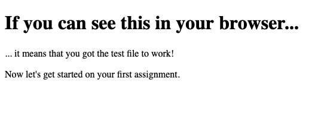

## Assignment #0: Setup VSCode

### Overview

VSCode is a code editor, which is one of the key tools you will be using to
write code throughout the entire bootcamp. There are many other code editors
out there, but for this bootcamp we will be using one of the most popular code
editor known as VSCode.

In Assignment #0, you will be setting up VSCode on your computer so you can
start writing code on your own computer, and you will be given a simple HTML
file to test that everything is working.

Optional viewing: Youtube [Learn VSCode in 7 mins](https://www.youtube.com/watch?v=B-s71n0dHUk)


### Instructions

- Create a folder or directory anywhere you like on your computer, and name it "open camp"
- [Download and Install VSCode](https://code.visualstudio.com/download)
    - Windows: Download `x64` from the `User Installer`
    - macOS: If you are not sure if your laptop has a Intel or Apple Silicon chip, download `Universal`

- Open VSCode after installing it
- Open the folder or directory you have created in step 1 in VSCode (File → Open Folder)
- Create a file named test.html, and paste the following into the file using VSCode

```
<!DOCTYPE html>
<html lang="en">
  <head>
    <meta charset="UTF-8">
    <meta name="viewport" content="width=device-width, initial-scale=1.0">
    <meta http-equiv="X-UA-Compatible" content="ie=edge">
    <title>HTML Test File</title>
  </head>
  <body>
    <h1>If you can see this in your browser...</h1>
    <p>... it means that you got the test file to work!</p>
    <p>Now you can get started on your first assignment.</p>
  </body>
</html>
```

- Open the file (test.html) with your web browser: using Explorer (Windows) or
  Finder (macOS) to find test.html, right click → open with your web browser





You should see something similar to the screenshot above in your browser: if so,
congratulations, your VSCode is now ready to help you write code and complete
your assignments. You may now close this tab or your web browser and proceed to
Assignment #1.


### Submission

There is nothing to submit for this assignment. Please use
VSCode to complete subsequent assignments.
