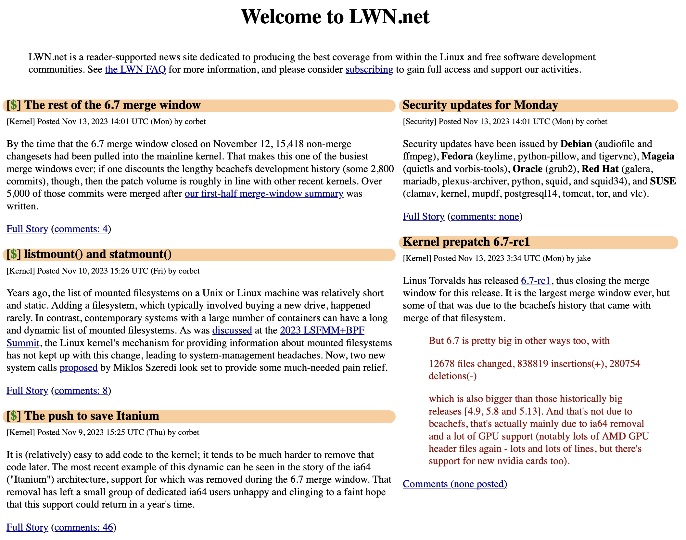

## Assignment #5: Grid and Flexbox Challenge

### Overview

Grid and Flexbox are common techniques used to construct various layouts that
you commonly see online. In this assignment, you will be using both techniques
to construct various layouts and see how they can be combined together to
form more complex layouts.

### Instructions

Recreate **one** of the following layouts using a combination of Gridbox and
Flexbox: both must be used, you can't just use one of them.

**Layout 1**

**Layout 2**

You may use any random text or numbers instead of the ones in the screenshot.

For images, you may use [Lorem Picsum][lorem-picsum] to generate random images.

### Hints

- Draw out how the grid and flexbox will look like on paper first before you start coding

### Additional Credits

Done with one layout? Try working on the other!

## Submission

To be updated.

[lorem-picsum]: https://picsum.photos/