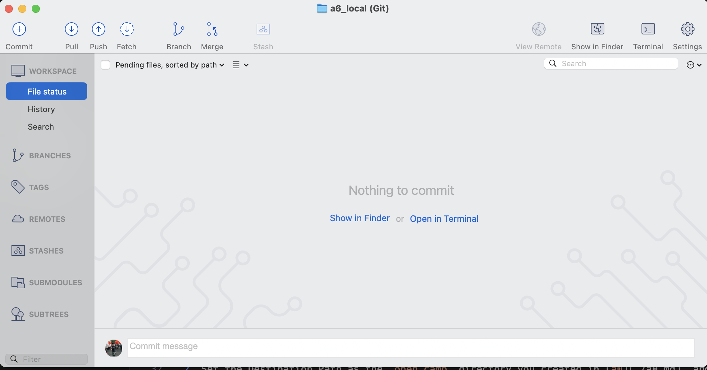

## Assignment #6: Git Commits

### Overview

Git is a source control tool that enables us to commit (save) and revert (undo)
changes to code, while enabling us to collaborate with others. While there are
many ways to use Git, such as via the Command-line or Terminal, we will start
with using Sourcetree so that you can visually inspect the changes that you have
done.

In this assignment, you will be accomplishing two different tasks: 

**Part 1**: Creating a Git repository locally, commit some
changes, and try out common operations that you need to know when using Git

**Part 2**: Clone a remote Git repository (on a service called GitHub) created
by us, make some changes and commit them, and submit a Pull Request that
contains your changes

In future assignments, you will be collaborating with other students via Git.

### Part 1

In Part 1, you will be creating a Git repository locally on your computer and
making changes to it. All these changes will only be visible to you.

A Git repository is simply a directory or folder that is managed by Git. Any
files added, removed, or changed in a Git repository will be tracked by Git, but
changes will only be committed (saved) when you manually execute a "Commit"
operation.

**Setup Instructions**

1. Create a Local Repository in Sourcetree (New.. -> Create Local Repository)
2. Set the Destination Path as the `open camp` directory you created in [a0](./a0.md), and add "/a6_local" behind it
    - eg. `/home/yourusername/open camp/a6_local` or `C:\somewhere\open camp\a6_local`
3. Set the Name to `a6_local`, and make sure that the Type is set to "Git"
4. Create the repository
5. Double click on the `a6_local` repository that you have just created, and you should see the following screen:

You are now ready to start Part 1 of this assignment.

**Instructions**

1. Create an empty text file named `hello.txt` in the `a6_local` directory that was created
    - eg. `/home/yourusername/open camp/a6_local` or `C:\somewhere\open camp\a6_local`
2. Notice that the User Interface for Sourcetree has changed; it now shows the
new file that you have just created
3. Check the checkbox next to `hello.txt` on Sourcetree and click on "Commit". A new textbox should appear below for you to type a "Commit Message".
    - Commit messages are short messages that describes that change you have made
    - Well written commit messages allow you and your collaborators to know what the change is about quickly
    - For now, let's go with a simple commit message: `Add hello.txt`
4. Your changes are now committed (saved) to the repository. You can see your changes by tapping on "History" on the left panel in Sourcetree.
5. Next, add a line of text into `hello.txt`, eg. `Hello world!`
6. You will once again notice that Sourcetree has now "tracked" that there are changes made to `hello.txt`
7. Commit the change with the message `Add hello text`
8. Now add 1 more line of text to `hello.txt`, you may add any text that you wish, and commit it with the commit message of your choice.
9. Repeat Steps 7 and 8 for another 3 times. You should end up with 5 lines in your repository's "History"
10. **Take a screenshot of your "History" tab for submission later**.

You will now revert (undo) all of your changes. Make sure to take a screenshot of your repository's "History" before you do the next few steps.

11. Right click on the very first commit (`Add hello.txt`) and select "Reset master to this commit"
    - Confirm the changes
12. Open up `hello.txt` and notice that the lines you have added previously are now gone

This concludes Part 1 of this assignment. You have now learnt the basics of Git
by making changes locally on your computer. Next, you will work with a remote
repository created by the `open camp` team and learn the basics of
collaboration.

### Part 2

In Part 2, you will be cloning a Git repository remotely on a remote server and
making changes to it. All these changes will be visible to you on your computer,
and you will learn how to make them available online for review by others.

## Submission

To be updated.